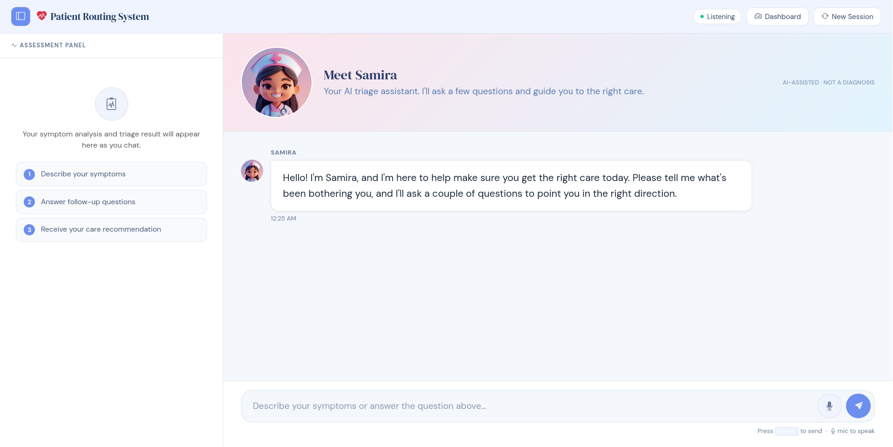
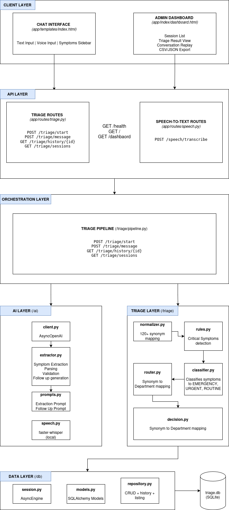
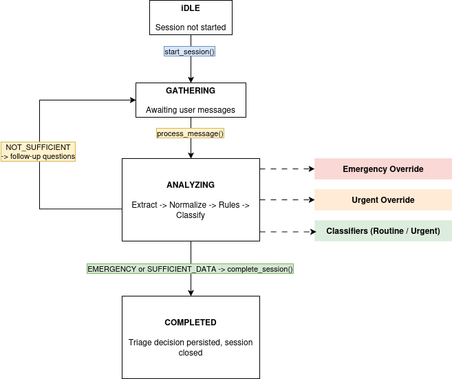
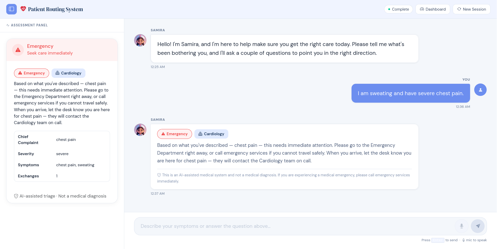
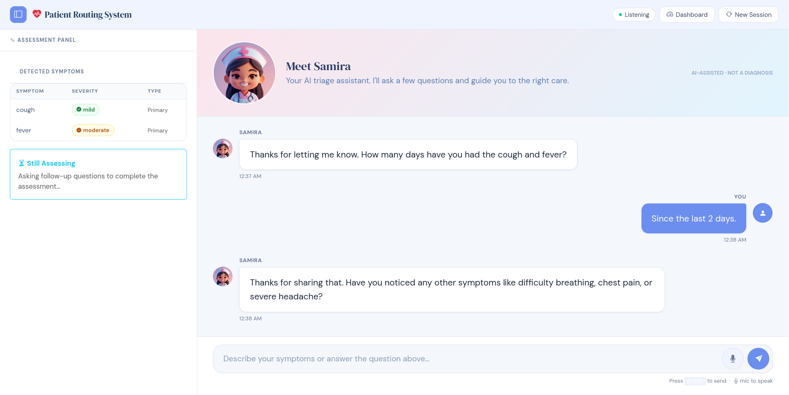
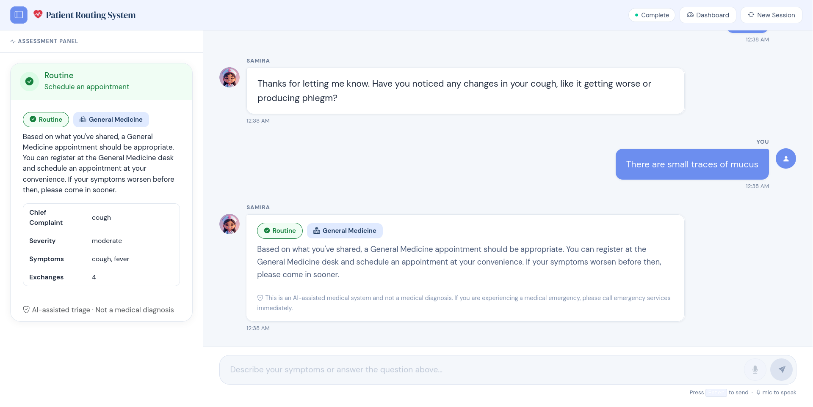
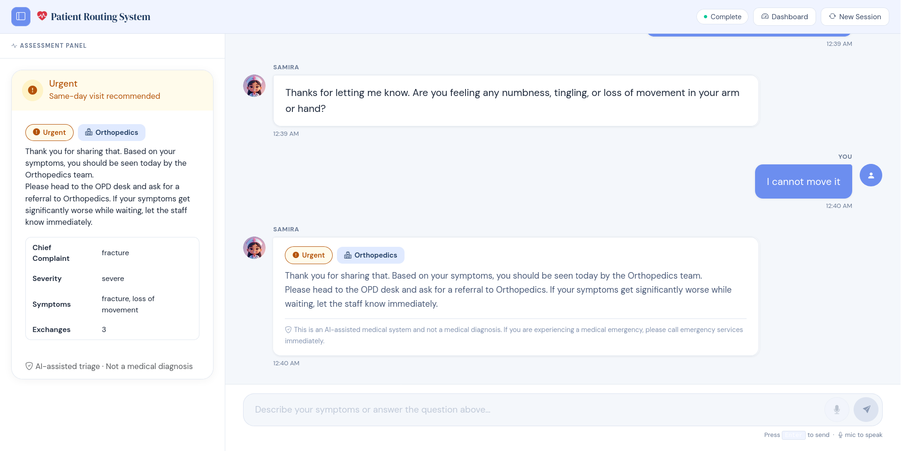
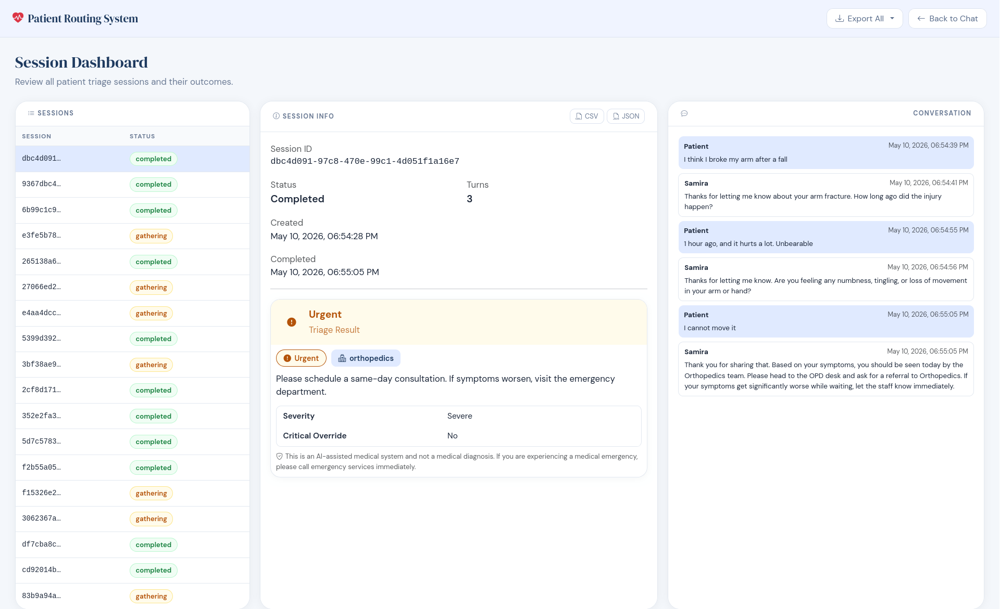
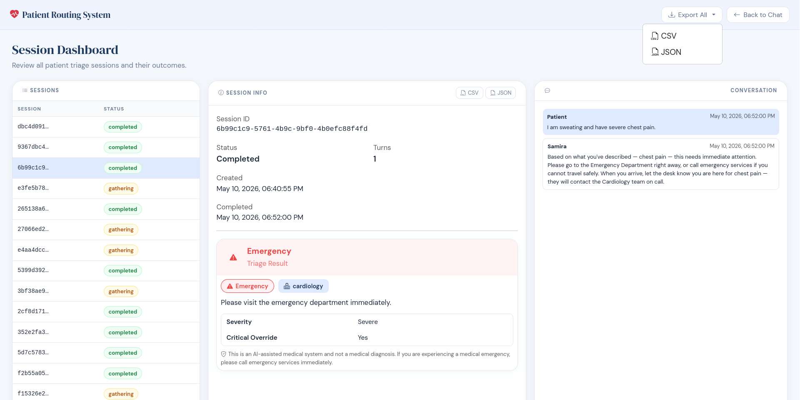

# Patient Routing System - Assessment by Abhiyan Acharya

## Overview
The Patient Routing System is an AI assistant that talks to patients, figures out what might be wrong, and tells them where to go. 

The system provides an assistant, *Samira*, who will talk with the patients about their symptoms and guide them to a department based on the urgency of the cases.

> **DISCLAIMER:** _Patient Routing System_ is an AI-assisted medical system and not a medical diagnosis.




### Workflow
1. Patient types or speaks through their symptoms.
2. Samira (Bot) asks follow up questions until the necessary information is obtained.
3. A decision is made based on the urgency of the case, alongside the associated department: 
  - `EMERGENCY` (visiting the ED immediately)
  - `URGENCY` (to be seen today)
  - `ROUTINE` (to book an appointment) 

## Approach Explanation
### System Overview
The system is built on a multi-stage triage pipeline:
```
User Message -> Symptoms Extraction -> Symptom Normalization -> Decision Rules -> Classification -> Route -> Response
```

Every step except `Symptoms Extraction` is deterministic and bounded by structured output constraints. LLM handles the extraction of possible symptoms from the user message.

### Pipeline Logic
#### 1. Symptom Extraction (`ai_extractor`)
LLM converts input text from the user into a structured JSON object.
By default, temperature is set to `0.1` and conversation history window is set to `6` exchanges.

_Example Input:_
> "I think I broke my arm after a fall, the pain is too much"

_Corresponding Output:_
```json
{
  "primary_symptoms": [{ "name": "broken_arm", "severity": "severe", "body_site": "arm", "duration": null }],
  "associated_symptoms": [],
  "negated_symptoms": [],
  "confidence": 0.95
}
```

#### 2. Normalization (`triage/normalizer.py`)
A static synonym map resolves extracted symptoms to canonical keys defined in `SYMPTOM_DEPARTMENT_MAP`. If target is not in the mapping, the startup fails and prevents silent routing failures.

__Example__:
`broken_arm` -> `fracture`

#### 3. Rules Engine (`triage/rules.py`)
In the rules engine, emergency rules are checked before classification (e.g. `limb_amputation`, `cardiac_arrest`). If true, the outcome is `EMERGENCY`.

__Rule__:
```
is_emergency = (symptom.name ∈ CRITICAL_SYMPTOMS) 
             ∨ (symptom.name ∈ SEVERITY_ESCALATES_TO_EMERGENCY 
             ∧ symptom.severity = SEVERE)

is_urgent = symptom.name ∈ URGENT_SYMPTOMS
```

#### 4. Classifier (`triage/classifier.py`)
If no rule override fires, then a decision is made. `EMERGENCY` is never returned here.

```
severe_count >= 1 -> URGENT
moderate_count ≥ 2 -> URGENT
confidence < 0.5 -> URGENT
else -> ROUTINE
```

__Example:__
- For symptoms of `[fracture(moderate)]` with confidence of `0.9`, the triage decision is `URGENT` (required immediate consulation)
- For symptoms of `[fever(moderate), cough(moderate)]` with confidence of `0.85`, the triage decision is `URGENT`
- For symptoms of `[mild_rash(mild)]` with confidence of `0.88`, the triage decision is `ROUTINE`

#### 5. Department Router (`triage/router.py`)
Each symptoms are mapped to a department. When multiple department matches, the department on highest priority is selected fron the list.

```
selected = argmin_{d ∈ matches} priority_index(d)
```

__Example - Patient reports chest pain (primary) and dizziness (associated) then:__
```
chest_pain -> CARDIOLOGY (priority index: 0)
dizziness -> NEUROLOGY (priority index: 1)

selected = argmin = CARDIOLOGY
```

#### 6. Conversation Sufficiency (`triage/decision.py`)
The triage is delayed by the pipeline until enough data is not collected (default: `MAX_TURNS=6` and `MIN_DATA_POINTS=3`)
```
sufficient(turn, extracted) = 
  turn ≥ max_turns
  ∨ (turn ≥ 3 ∧ has_duration ∧ |symptoms| ≥ min_data_points)
  ∨ (turn ≥ 4 ∧ has_duration)
  ∨ (turn ≥ 4 ∧ |symptoms| ≥ min_data_points)
```

__Example:__

Turn 1: Symptom `[headache]`, Duration `no` then sufficient is `False` (`turn < 2`) -> *ASKS FOLLOW UP*

Turn 2: Symptom `[headache, nausea]`, Duration `no` then sufficient is `False` (`turn < 2`) -> *ASKS FOLLOW UP*

Turn 3: Symptom `[headache, nausea, fever]`, Duration `2 days` then sufficient is `True` (`turn = 3, duration = True, |s| = 3`) -> **TRIAGE**

> When `sufficient = False`, the LLM generates one contextual follow up question from `generate_follow_up` method form `ai/extractor.py`.

## System Architecture


## State Diagram


## Setup Instructions
### Prerequisities
- Python 3.10.20+
- An Azure OpenAI (Microsoft Foundry) resource with a deployed model (e.g. `gpt-4o`)

### 1. Clone and Install
```bash
git clone https://github.com/aveeyan/patient-routing-system.git
cd patient-routing-system
pip install -r requirements.txt
```
> Recommended: Use a virtual environment such as `venv` or `conda`.

### 2. Configure Environment
Create a `.env` file using the template from `.env.example`.
```
# Azure OpenAI Services
AZURE_OPENAI_ENDPOINT=https://yourazureopenaiendpoint.openai.azure.com/
AZURE_OPENAI_API_KEY=xxx
AZURE_OPENAI_DEPLOYMENT_NAME=gpt-4.0
AZURE_OPENAI_API_VERSION=2025-04-14

# Azure Speech
AZURE_SPEECH_KEY=xxx
AZURE_SPEECH_REGION=xxx

# Optional Overrides
AZURE_OPENAI_TEMPERATURE=0.1

# Database
DATABASE_URL=sqlite+aiosqlite:///./triage.db

# Logging
LOG_LEVEL=INFO

# Triage Settings
MIN_DATA_POINTS=4
MAX_CONVERSATION_TURNS=5
```

### 3. Run
```bash
uvicorn app.main:app --reload
```

### 4. Speech Transcription (Optional)
Uses `faster-whisper` locally, and no external speech API required. Model size is configurable:
```env
WHISPER_SPEECH_MODEL_SIZE=small
```

### 5. API Flow
```
POST /triage/start          → { session_id, message }
POST /triage/message        → { session_id, message: "..." }
GET  /triage/history/{id}   → full session transcript
GET  /triage/sessions       → paginated session list
POST /speech/transcribe     → { audio: <file> } → { text }
```


## Assumptions Made
### 0. Overview
- **STATES:** IDLE, GATHERING, ANALYZING, COMPLETED
- **URGENCY:** EMERGENCY, URGENT, ROUTINE _(priority-wise)_
- **SEVERITY:** SEVERE, MODERATE, MILD _(priority-wise)_
- **DEPARTMENT:** CARDIOLOGY, NEUROLOGU, PULMONOLOGY, ... , GENERAL MEDICINE _(priority_wise)_ 

### 1. **URGENCY** does **NOT** equal to department
Urgency ("how fast") and Department ("which team") are orthogonal signals.
> A severe toothache is `URGENT` for `Dental`, not `EMERGENCY` for `General Medicine` 

### 2. **EMERGENCY** escalation for appropriate symptoms
> A triage is `EMERGENCY` only when `severity = SEVERE` and a clinically appropriate symptom in `CRITICAL_SYMPTOMS` (e.g. `heavy_bleeding`).

### 3. **CONFIDENCE** under 0.5 defaults to **URGENT**
> `Priority(undertriage harm) > Priority(overtriage cost)`.

### 4. **Suicidal ideation** is **EMERGENCY** priority
> Won't receive a general ED message.

### 5. **No memory** in LLM calls
> LLM has no memory between calls. Full conversation history is injected each time.

### 6. **SQLite** sufficiency
> SQLite is sufficient for current scope. Swapping to PostgreSQL requires only a connection string change.

## Screenshots











